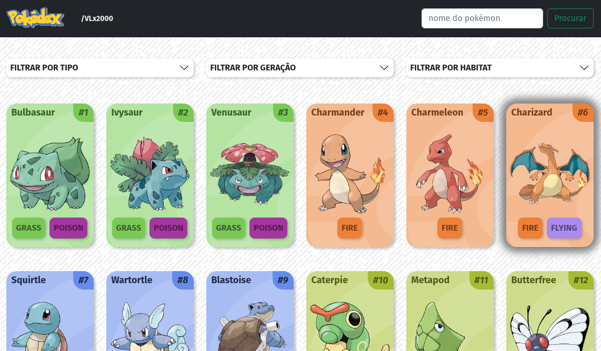

# Pokédex
> Uma pokédex em React que utiliza a [PokéAPI](https://pokeapi.co/) em sua versão [GraphQL](https://pokeapi.co/docs/graphql)



### Tecnologias utilizadas
- TypeScript
- Bootstrap
- GraphQL
- Axios
- React Router Dom

### [Link para o site](https://vlx2000.github.io/pokedex/)

### Para executar localmente
```npm install && npm run dev```

> É possível acessar sua versão em REST/Javascript por [aqui](https://github.com/VLx2000/pokedex/tree/rest)

